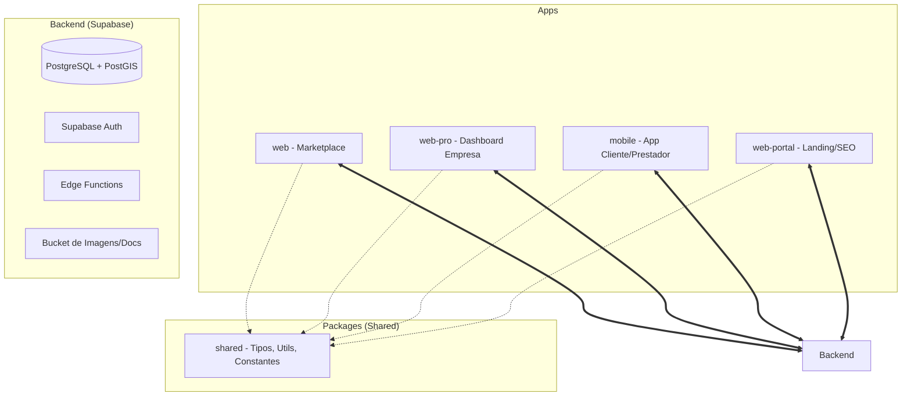
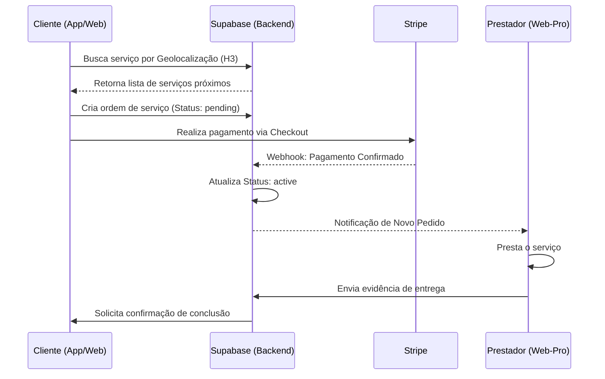
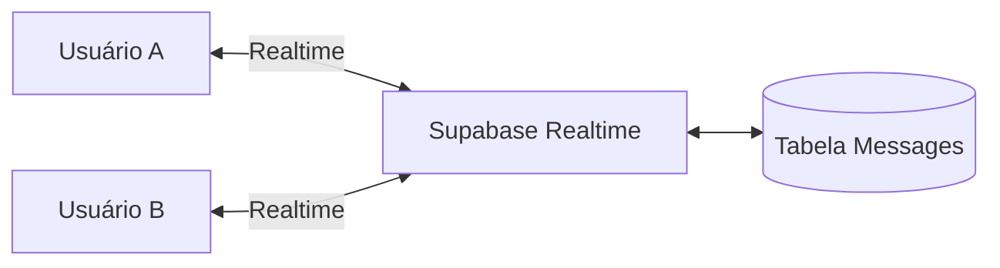

# Análise Técnica e Detalhamento do Projeto TGT Marketplace

Este documento fornece uma visão 360º do ecossistema TGT, abrangendo arquitetura, lógicas de negócio e fluxos operacionais.

---

## 1. Visão Geral da Arquitetura

O projeto é estruturado como um **Monorepo Gerenciado via Turborepo**, permitindo o compartilhamento de código e tipos entre as diferentes interfaces.

### Segmentação de Aplicações

Para otimizar o SEO, a escalabilidade e a experiência do usuário, o projeto divide as interfaces em três aplicações web distintas e uma mobile:

| Aplicação | Nome Interno | Público-Alvo | Função Principal | Acesso |
| :--- | :--- | :--- | :--- | :--- |
| **Marketplace** | `web` | Clientes (B2C) | Descoberta, Chat e Contratação | Aberto (com Login) |
| **Portal Pro** | `web-portal` | Empresas (B2B) | Gestão Administrativa e Dashboard | Privado (Auth Requirido) |
| **Landing Page** | `web-pro` | Empresas (B2B) | Vendas, SEO e Captação de Parceiros | Aberto (Foco Google) |
| **App Mobile** | `mobile` | Clientes/Pros | Uso em trânsito e Notificações Push | Lojas (iOS/Android) |

---

## 2. Detalhamento dos Módulos Web

### A. web (Marketplace do Cliente)
Focado na jornada de compra do consumidor final.
- **Funcionalidades**: Busca geolocalizada, filtros de categoria, visualização de perfis de prestadores, fluxo de checkout e chat em tempo real.
- **Stack**: React + Vite, integração direta com Supabase para dados de consumo.

### B. web-portal (Portal Administrativo "Fechado")
A interface de gestão para as empresas e prestadores de serviço.
- **Funcionalidades**: Dashboard financeiro, gestão de agenda, cadastro de serviços, portfólio, avaliações, equipe e orçamentos.
- **Segurança**: Protegido por `AuthGuard`, acessível apenas para usuários do tipo `company`.

### C. web-pro (Landing Page Comercial e SEO)
Uma aplicação leve focada em converter novas empresas para a plataforma.
- **Funcionalidades**: Explicação do modelo de negócio ("Como Funciona"), planos de assinatura, páginas de termos/ajuda e contato.
- **Foco**: Rankeamento orgânico no Google para palavras-chave relacionadas a parcerias e patrocínios.

---

## 3. Estrutura do Monorepo

---

## 3. Lógicas de Negócio Principais

### A. Geolocalização (H3 Uber + PostGIS)
Diferente de buscas radiais tradicionais que pesam no banco, o TGT utiliza o **H3 (sistema de indexação hexagonal da Uber)**.
- **Como funciona**: O mundo é dividido em hexágonos de diferentes resoluções. As coordenadas de empresas e serviços são convertidas em um `h3_index`.
- **Vantagem**: Permite buscas de proximidade extremamente rápidas e cálculos de densidade com baixo custo computacional.

### B. Fluxo de Pagamento (Stripe Connect)
O TGT opera no modelo de Marketplace:
1. **Application Fee**: A plataforma retém uma porcentagem (comissão) sobre cada transação.
2. **Stripe Connect**: O valor restante é enviado diretamente para a conta bancária do prestador de serviço conectada ao Stripe.

### C. Fluxo de Contratação (Booking & Quotes)
Existem dois caminhos principais para um serviço:
- **Compra Direta**: Serviços com preço fixo e pacotes definidos.
- **Orçamento (Quotes)**: Serviços que dependem de variáveis específicas (ex: reformas). O cliente solicita um orçamento, o prestador responde, e após aprovação, o pagamento é liberado.

---

## 4. Diagramas de Fluxo (Mermaid)

### Fluxo de Reserva e Pagamento (Contratação Direta)

### Arquitetura de Comunicação (Chat)

---

## 5. Análise SWOT (Pontos Fortes e Fracos)

### Pontos Fortes
- **Escalabilidade Geográfica**: O uso de H3 coloca o projeto no mesmo nível de arquitetura de gigantes como Uber e iFood.
- **Segurança Nativa**: Utilização intensiva de RLS (Row Level Security) no Supabase, garantindo que dados de empresas não vazem.
- **Frontend Moderno**: Uso de Vite para builds instantâneos e performance superior ao Webpack tradicional.

### Pontos Fracos / Desafios
- **Discrepância de Arquitetura (Drift)**: Documentos de planejamento sugerem NestJS/Spring Boot, mas o projeto é 100% Supabase. Isso pode causar confusão para novos desenvolvedores.
- **Complexidade de Migrações**: Como o projeto cresceu rápido, há muitas migrações SQL que precisam ser gerenciadas com cuidado. Erros de `enum` e referências ambíguas em RPCs (ex: `order_status`, `get_chat_threads`) são riscos recorrentes.
- **Dependência de BaaS**: A forte integração com Supabase facilita o MVP, mas requer atenção à latência em Edge Functions e limites de concorrência do Postgres.
- **Redundância de UI**: Alguns componentes de UI estão duplicados entre `web` e `web-pro`, necessitando de uma refatoração em `packages/shared` ou um `packages/ui`.
- **Sincronização de Schema**: O cache de schema do Supabase às vezes causa erros de "Tabela não encontrada" quando alterações de DDL são feitas sem recarregar o postgrest.

---

## 6. Próximos Passos e Roadmap Técnico

1. **Unificação de UI**: Migrar componentes visuais core para um pacote compartilhado.
2. **Otimização de SEO**: Melhorar a geração dinâmica do `web-portal` para cidades/categorias.
3. **Escrow Avançado**: Refinar o sistema de retenção de valores para disputas prolongadas.

---
*Documento gerado automaticamente pela Antigravity em 12/03/2026.*
